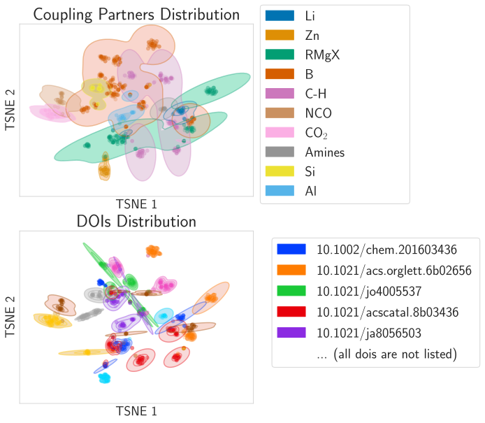

# Prediction of reaction yields on a chemical diversity calibrated dataset: the NiCOLit dataset

This is the code used to generate the results published in [Machine Learning Yield Prediction from NiCOlit, a Small-Size Literature Data Set of Nickel Catalyzed C–O Couplings](https://pubs.acs.org/doi/abs/10.1021/jacs.2c05302)

A preprint version is available on [ChemArxiv](https://chemrxiv.org/engage/chemrxiv/article-details/6284d433d555509f629e4de2).

The NiCOlit dataset is accessible [here](https://github.com/truejulosdu13/NiCOlit/blob/master/data/NiCOlit.csv).



# Description :

A description of the different folders is given below :

- **aqc_utils** : this folder contains usefull tools released by [Auto-QChem](https://github.com/PrincetonUniversity/auto-qchem/).
- **data** : 
  * the NiCOlit dataset downloadable [here](https://github.com/truejulosdu13/NiCOlit/blob/main/data/NiCOlit.csv).
  * HTE : HTE datasets published by [D. T. Ahneman *et al.*](https://www.science.org/doi/10.1126/science.aar5169) and [A. B. Santanilla *et al.*](https://www.science.org/doi/10.1126/science.1259203) and used in a publication of [P. Scwhaller](https://rxn4chemistry.github.io/rxn_yields/).
  * utils : csv files of DFT molecular featurization needed for DFT-featurization.
  * rxnfp_featurization : csv files of Ahneman,  Santanilla and NiCOlit datasets featurized with the RXNFP method.
- **descriptors** :
  * preprocessing of the NiCOlit dataset.
  * DFT and RDKit featurisation.
- **images** : All images displayed in the article.
- **notebooks_dft** : All notebooks allowing to compute the DFT featurizations of molecules in the dataset
- **notebooks_ord** : All notebooks necessary for producing the csv for ORD submission of NiCOlit
- **notebooks_dataset_analysis**:
  * 01_visualization_chemical_analysis: Displays the relative occurences of coupling-partner/substrate/ligand pairs in NiCOlit (Figure 1 of the paper)
  * 02_visualization_diversity_and_scope_optimization_structure: Analysis of the dataset's chemical diversity and scope optimisation structure (Figure 2 and 3 of the paper)
  * 03_visualization_chemical_space_exploration: Displays the dataset with an analysis of DOI/coupling partners/substrate repartition within the dataset (Figure 4 of the paper)
  * 04_visualization_nickel_precursors: visualiszing catalysts precursors 
- **notebooks_prediction_results**: all notebooks necessary to run the different machine learning models
- **notebooks_prediction_visualisation**: all notebooks necessary to analyze the predictions of machine learning models

# Install requirements

Best use with following requirements :
```
pip install -r requirements.txt
```

# Reproducing figures and experiments

In order to reproduce the figures and experimens from the paper, you can run in order the notebooks in the different **notebooks** sections (except the ones in the **notebooks_dft**, that were used to compute the DFT descriptors which are direclty accessible in the data folder). The only prerequisite is running the notebooks from **notebooks_prediction_results** before those from **notebooks_prediction_visualization**. 

